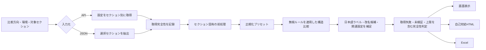

# 差分比較ロジック説明

この資料は、`kintone-lite-suite` の `tools/差分比較.js` が、2つの kintone アプリ設定をどのように取得し、対応付け、差分として判定するかを説明します。

- 対象: 公開中の Lite 版差分比較パネル、そこから生成する HTML / Excel
- 想定読者: 差分をレビューする人、運用担当者、比較ロジックを保守する開発者
- 正規実装: [`engine.ts`](../tools/統合ツール/src/diff/engine.ts)、[`diff-standalone.ts`](../tools/統合ツール/src/tabs/diff-standalone.ts)
- 更新日: 2026-08-27

## 1. 先に読む結論

比較結果を読むときは、次の順番を守ります。

1. **完全性** — 取得失敗、本文未検証、件数上限がないか
2. **比較方向** — 比較元から比較先へ、左から右に読む
3. **客観的な差分** — どちらに存在するか、内容か順序が違うか
4. **人による判断** — 対応が必要か、業務にどう影響するか

このツールが自動判定するのは 1〜3 です。重要度、業務影響、対応優先度は自動判定しません。「関連している設定」は参照関係の事実であり、影響や因果関係の断定ではありません。

完全性に問題がある場合、差分が0件でも「一致」「差分なし」とは判断できません。

## 2. 比較方向と用語

画面とレポートは、比較元を `BEFORE / left`、比較先を `AFTER / right` として左から右へ読みます。

| 内部種別 | 人向けの意味 | 存在状況 |
|---|---|---|
| `added` | 追加として検出 | 比較先にのみ存在 |
| `removed` | 削除として検出 | 比較元にのみ存在 |
| `changed` | 内容が異なる | 両方に存在 |
| `changed` + `moved:true` | 並び順が異なる | 両方に存在 |
| `same` | 内容が一致 | 両方に存在 |
| `_displayOnly:true` | 理解を助ける参考行 | 実差分ではない |
| `_nonActionable:true` | レビュー対象だが自動反映できない差分 | 実差分として数える |

たとえば比較元にだけフィールドがある場合、左から右へ進むとその値がなくなるため `removed` です。これは比較結果の表現であり、「比較先から削除する」という実行指示ではありません。

### 件数表示の注意

エンジン内部では、移動行は後方互換のため `changed` 件数にも含まれます。現在の Lite パネルと HTML レポートは重複を避け、次の排他的な見せ方をします。

```text
内容変更件数 = changed - moved
並び順差件数 = moved
```

## 3. 全体フロー



処理順が重要です。正規化と無視ルールは表示だけのフィルターではなく、差分計算そのものへ適用されます。条件を変えた場合は再比較が必要です。

## 4. 入力と設定取得

### 4.1 比較対象

Lite 版は17セクションを選択できます。既定ではフィールド、レイアウト、ビュー、プロセスが選択されています。

- アプリ設定、フォーム設定
- フィールド、レイアウト
- ビュー、グラフ
- プロセス、アクション
- JS/CSS、プラグイン
- アプリ権限、フィールド権限、レコード権限
- 通知、レコード条件通知、リマインダー、カテゴリ

比較するのはアプリの設定です。各レコードに保存された業務データそのものは比較対象ではありません。

### 4.2 API取得

比較元と比較先は、それぞれ次を独立して指定します。

- App ID
- ゲストスペースID
- 運用環境 / プレビュー環境

APIプレフィックスは指定に応じて切り替わります。

| 環境 | APIプレフィックス |
|---|---|
| 通常・運用 | `/k/v1` |
| 通常・プレビュー | `/k/v1/preview` |
| ゲスト・運用 | `/k/guest/{guestId}/v1` |
| ゲスト・プレビュー | `/k/guest/{guestId}/v1/preview` |

取得は読み取りGETです。一過性の通信エラー、408 / 409 / 425 / 429、5xxは最大3回まで再試行します。

セクションは順次取得されるため、すべての設定が同一瞬間に取得された原子的スナップショットではありません。比較中にアプリ設定が変更された場合、セクションごとの取得時刻がずれる可能性があります。

### 4.3 設定JSONの読込

APIの代わりに、比較元・比較先それぞれへ設定JSONを指定できます。単体バンドル、ラッパー形式、複数アプリ配列に対応します。

選択したセクションがJSONにない場合は、片側に存在しない設定とは扱いません。`_fetchError` として「比較不能」にし、誤った追加・削除を防ぎます。

取得・読込後のバンドルは複製してから比較します。比較処理の前処理が、元の読込データや次の比較へ混入しないためです。

現在のJSON読込には、次の運用上の注意があります。

- 入力欄へApp IDを明示した場合、JSON内に同じApp IDの候補がなければ、候補が1件だけでも読込を拒否する
- App IDを入力していない単一候補のJSONは、その1件を採用する
- `fetchedAt`がないJSONには読込時刻を補うため、元データの実取得日時とは限らない
- 読込ファイル自体のサイズ上限は設けていない

App ID照合は別アプリの設定を誤って読むことを防ぎます。ただし、JSONの真正性や取得完全性を証明するものではありません。ファイル名、取得元、App ID、取得日時も人が確認してください。

## 5. 取得失敗と一部未検証

### 5.1 セクション取得失敗

比較元または比較先のセクションに `_fetchError` がある場合、そのセクションは比較しません。

- 差分行は作らない
- 比較元 / 比較先 / 両側のどこで失敗したかを `fetchIssues` に記録
- 結果全体を「不完全」にする

取得失敗を「設定が存在しない」と解釈しないことが、偽の追加・削除を防ぐ基本ルールです。

### 5.2 JS/CSS本文

JS/CSSカスタマイズは、設定一覧だけでなく取得可能なファイル本文も比較します。

| 条件 | 扱い |
|---|---|
| 両側で本文取得成功 | `fileKey`ではなく本文を比較 |
| 同じ本文を再アップロード | `fileKey`が変わっても差分にしない |
| 1MB超、非テキスト形式、fileKeyなし | `fileKey`比較へ戻し「本文未検証」 |
| HTTP / 通信で本文取得失敗 | JS/CSSセクション全体を比較不能 |

本文取得の対象はテキスト系拡張子で、1ファイル1MBまで、同時6件です。通信失敗時は補助取得を1回再試行します。ファイルAPIにはプレビュー用エンドポイントがないため、本文は運用側プレフィックスから取得します。

片側だけ本文を取得できた場合も、左右を異なる基準で比べず、両側を `fileKey` 比較へ揃えます。この場合は結果を「一部未検証」とします。

### 5.3 プラグイン設定

プラグイン一覧に加え、各プラグインの設定を取得し、通常のオブジェクトとして比較します。1件でも設定取得に失敗した場合、取得できたプラグインだけで比較を続けず、プラグインセクション全体を比較不能にします。

旧形式の設定JSONでプラグインセクション直下に残る `fetched` / `skipped` / `failed` は取得処理の集計値であり、プラグイン設定そのものではないため差分へ数えません。`failed` または `skipped` が1件以上なら、通常の差分ではなく取得不完全の警告として扱い、そのセクションを比較不能にします。現在の設定取得でも、ID欠落や不正な応答で設定を取得できなかった項目は同様に比較不能として扱います。

## 6. 比較前の正規化と無視ルール

### 6.1 常に無視するメタ情報

既定で次のキーを無視します。

- `revision`
- `createdAt`
- `creator`
- `modifiedAt`
- `modifier`

ただし、名前付きマップ直下のキーはフィールドコード、ビュー名、状態名などの識別子です。たとえば `revision` というフィールドコードを、既定無視キーと同名だからという理由で消さない保護があります。

### 6.2 手動の無視ルール

| 形式 | 例 | 意味 |
|---|---|---|
| キー名 | `description` | すべての階層で同名プロパティを無視 |
| パス | `fieldSettings.properties.customer.label` | 指定パスを無視 |
| ワイルドカード | `*.description` | パターンに一致するパスを無視 |
| `path:`完全パス | 結果行の「次回から除外」で追加 | 記号・空白・大小文字を含め、その1パスだけに一致 |

通常ルールは前後空白とゼロ幅文字を除去し、英字の大小文字を区別しません。ワイルドカードはパス全体へ一致します。`path:`形式だけは、大小文字を含む元のパスへ完全一致します。

配列番号を含むパス、たとえば `items[3].label` は、並び替え後に別の対象を隠す危険があります。Lite UIはこの位置依存ルールを検出すると比較を開始せず、見直しを求めます。

### 6.3 正規化プリセット

正規化は、対象セクションのオブジェクトから指定キーを再帰的に除去します。順序無視を含むプリセットでは、入れ子を含む配列を正規化後のJSON文字列で並べ替えます。

| プリセット | 主な対象 | 無視する内容 |
|---|---|---|
| ビュー/グラフ/アクション順序 | ビュー、グラフ、アクション | `index` / `no` / `order`と配列順 |
| 権限/通知/カテゴリ順序 | 各権限、通知、カテゴリ | `index` / `no` / `order`と配列順 |
| すべての配列順序 | プロセス等を含む広い範囲 | `index` / `no` / `order`と配列順 |
| フィールド/レイアウト順序 | フィールド、レイアウト、フォーム | 順序、`x` / `y` |
| プロセスの並び順 | プロセス | `index` / `no` / `order`と配列順 |
| 環境固有ID（アプリ・一覧・グラフ・アクション） | アプリ情報、フィールド、一覧、グラフ、アプリアクション | 比較対象・参照先のApp IDと、一覧・グラフ・アクション自身の内部ID |
| 監査/リビジョン情報 | 広い範囲 | ID、リビジョン、作成・更新者と日時 |
| ラベル/説明文/ヘルプ | 表示文言を持つセクション | 名称、ラベル、説明、ヘルプ等 |
| 見た目/幅/座標 | フィールド、レイアウト等 | 幅、高さ、座標、表示サイズ等 |
| 添付/JS/CSS fileKey | ファイル参照を持つセクション | fileKey等 |
| 有効/無効フラグ | プロセス、プラグイン、通知等 | `enable` / `enabled`等 |

複数プリセットを有効にすると、対象セクションごとに無視キーとパス限定条件を合算し、いずれかが順序無視なら配列順も無視します。「環境固有ID（アプリ・一覧・グラフ・アクション）」は一般名の `app` / `id` を一律に消さず、API上で比較対象・参照先のApp ID、または一覧・グラフ・アクション自身の内部IDだと意味が確定するパスだけに適用します。フィールド設定と旧 `/form.json` のフォーム設定は同じ参照IDを持つため、どちらのセクションにも同じ条件で適用します。

Lite画面では「環境固有ID（アプリ・一覧・グラフ・アクション）を比較から除外」を「よく使う除外」として常時表示します。初期状態はオフです。有効にしても、フィールドコード、照合フィールド、一覧条件、アクションの対応付け、プラグインID、独自設定内の一般的な `app` / `id` は除外しません。条件を変更した後は再比較が必要で、再比較後の差分件数・画面結果・Excelへ同じ条件を反映します。

> 注意: 正規化は便利な表示切替ではありません。比較対象から情報を除外します。「すべての配列順序」「環境固有ID」「有効/無効」などを無視すると、運用上意味のある差分も消える可能性があります。

## 7. 基本の構造比較

比較はJSONの型と構造を保ったまま、再帰的に行います。

### 7.1 プリミティブ値

- `===` で一致すれば同一
- 型が違えば変更
- 同じ型で値が違えば変更

`"100"` と `100`、`"true"` と `true` は厳密には変更です。ただし人が区別しやすいよう「表記のみ（実質同値）」の補助情報を付けます。

空文字、空白文字列、`null` / `undefined`、空配列、空オブジェクトの相互差は「空値の差のみ」と注記します。`0` と `false` は空値ではありません。

補助情報は差分を消しません。また重要度の判断にも使いません。

### 7.2 オブジェクト

1. 比較元と比較先のキーを合わせる
2. キーを辞書順に処理する
3. 比較先だけのキーを `added`
4. 比較元だけのキーを `removed`
5. 両側にあるキーを再帰比較する

無視対象のキーやパスは、署名作成と再帰比較の両方から除外します。

## 8. 配列の対応付け

配列は、単純に同じ番号どうしを比較すると、先頭への1件追加だけで後続すべてが変更に見えます。そこで次の優先順で、同じ業務要素を対応付けます。

| 優先 | 方式 | 用途 |
|---:|---|---|
| 1 | kintone固有の複合キー | 権限、通知、アクション等 |
| 2 | 一意な単一キー | `code`、`id`、`name`等を持つオブジェクト |
| 3 | 純粋な並び替え | 内容の多重集合が同じ配列 |
| 4 | LCS（最長共通部分列） | 安定キーがない一般配列 |
| 5 | 配列番号 | LCSの計算量上限を超えた場合 |

### 8.1 kintone固有の複合キー

| 対象 | 識別子 |
|---|---|
| アプリ権限 | `entity.type : entity.code/login` |
| フィールド権限・レコード権限の対象 | `entity.type : entity.code/login` |
| 一般通知 | 宛先エンティティ |
| レコード条件通知・リマインダー | 空でないタイトル |
| プロセス・アプリアクション | `name|from|to` |

識別子が欠ける、または同じ識別子が片側の配列内で重複する場合は、誤った対応付けをせず次の方式へ進みます。

アクション名が両側で一意な場合は `name` だけで対応付けます。これにより `from` / `to` の変更を、アクションの削除＋追加ではなく、同じアクションの内容変更として扱えます。

### 8.2 一意な単一キー

候補は次の順です。

```text
code → id → name → entity → field → status → state → app → from → to → key → その他の共通キー
```

採用条件は、両側の全要素がオブジェクトで、全要素にそのキーがあり、値がnullでない一意なプリミティブであることです。booleanは識別子にしません。数値`1`と文字列`"1"`は型が違うため別の識別値です。

同じキーの要素は次のように扱います。

- 内容も位置も同じ: `same`（同一行出力を選んだ場合）
- 内容が同じで位置だけ違う: `moved`
- 内容が違う: 子プロパティを再帰比較
- 片側だけにある: `added` / `removed`

内容と位置が同時に変わった場合、この方式では内容差分を優先し、独立した移動行は作りません。

### 8.3 純粋な並び替え

正規化後の要素の多重集合が同じで、位置だけ違う場合、追加・削除の組ではなく移動として報告します。

```text
比較元: [A, B, C]
比較先: [C, A, B]
結果  : 位置が変わった要素を moved として表示
```

同じ内容が重複する配列では、先頭から未使用の要素へ対応付けます。そのため、見分けられない同一要素について「どの個体が移動したか」までは保証できません。

### 8.4 LCS

安定キーがなく、純粋な並び替えでもない場合は、正規化済み要素の最長共通部分列を使います。

- 共通要素は位置を保つ
- 対応可能な同型要素は内部を再帰比較
- 残りを追加・削除として扱う
- 同一内容の追加・削除ペアは、最後に1件の移動へ統合する

```text
比較元: [A, B, C]
比較先: [B, C, A, D]

結果:
- A: 1番目から3番目へ移動
- D: 比較先に追加
```

LCSの表サイズは `比較元の要素数 × 比較先の要素数` で、上限は60,000セルです。上限を超え、他の対応付けも使えない場合は同じ配列番号どうしを比較します。この場合、大きな挿入・削除が位置ごとの変更として見えることがあります。

## 9. セクション固有の補正

### 9.1 プロセス状態の改名

状態名を変えると、その状態本体に加え、すべての遷移アクションの `from` / `to` が連鎖して変わります。これを多数の独立差分として数えないため、次の条件で改名を吸収します。

1. 比較元だけ、比較先だけにある状態を抽出
2. `name` と `index` を除いた状態本体を比較
3. 同じ本体の候補が左右それぞれ1件だけなら改名候補として扱う
4. 比較元の状態名とアクション参照を仮想的に新名へ置換
5. 置換後の内容を通常比較
6. 改名をレビュー対象の実差分として表示

候補が複数ある場合は推測せず、通常の追加・削除を残します。名前だけが変わった場合も、改名行は実差分として1件に数え、画面・HTML・Excelへ出力します。ただしプロセス状態名だけを安全に自動反映するAPI操作へ変換できないため、`_nonActionable:true` として反映選択とパッチ生成から除外します。プロセス管理APIはセクション全体を置き換えるため、状態名変更が1件でもある `withCompared` HTMLでは反映JSON全体を無効にします。統合版のセクション単位反映でもプロセス管理をブロックし、行／ノード単位で状態名変更以外を選ぶか、管理画面で手動確認します。

### 9.2 一般の改名候補

フィールド、ビュー、グラフ、通知等で、削除行と追加行の型・本体・名称が十分似ている場合に「改名候補」を付けます。

これは候補表示です。一般の改名候補では元の追加・削除行を消さず、比較結果の事実を保持します。プロセス状態の一意な改名だけが、前項の専用ロジックで参照カスケードを吸収します。

### 9.3 人間向けの補足

構造比較後に、次を表示用メタデータとして加えます。

- 内部パスを日本語の項目名・理由へ変換
- フィールドやエンティティの改名候補
- そのフィールドや状態を参照している設定
- セクション全体の追加・削除を、エンティティ単位で読める参考行へ展開
- SUBTABLE全体の追加・削除を、内包フィールド単位の参考行へ展開

参考行は親の実差分を残したまま追加され、実差分件数・反映対象には入りません。セクション全体の表示展開は親1行につき最大200行です。

「関連している設定」は参照先を検索した結果です。実行順、障害、業務影響、対応優先度を判定するものではありません。

## 10. 上限と完全性

| 上限 | 値 | 超えたとき |
|---|---:|---|
| 実差分行 | 1,000 | 現在のセクションを部分走査、後続を未走査として記録 |
| 同一行 | 3,000 | 以降の同一証跡を省略し、省略数を `droppedSame` に記録 |
| LCS | 60,000セル | 配列番号比較へフォールバック |
| 表示用エンティティ展開 | 親1行につき200 | 参考行だけを打ち切り |
| HTML収録 | 展開後2,000行 | 実差分→参考行→同一行の順で収録 |

画面は200行ずつ明細を追加表示します。これは描画負荷を抑えるページングであり、比較の検出上限ではありません。

差分上限の状態は区別して記録します。

| 状態 | 意味 | 件数の読み方 |
|---|---|---|
| `partial` | 走査中に上限へ到達 | 表示件数は下限、総数は不明 |
| `unscanned` | 上限到達後のため未走査 | 件数不明 |
| `complete` + 省略数 | 走査でき、省略数も判明 | 表示件数と省略数を分けて確認 |

ちょうど1,000件に到達した場合も、その先に差分がないことを確認できないため、保守的に部分走査とします。

次のいずれかがあれば、実差分の結果全体は不完全です。

- APIまたはJSONのセクション取得失敗
- JS/CSS等の本文未検証
- 実差分の件数上限
- HTMLレポートの収録上限

不完全な結果で差分0件でも、一致とは判断しません。

同一行だけが3,000件を超えた場合は、実差分の走査自体は完了しています。省略した同一証跡の件数は `droppedSame` と上限情報へ残しますが、実差分の完全性は「完全」のままとし、反映機能も無効にしません。

## 11. 一括比較

### 11.1 1対多比較

複数比較は、同じ比較元を複数の比較先へ順番に照合します。

1. 比較元を最初の1回だけ取得する
2. 比較元バンドルを複製し、後続比較で再利用する
3. 比較先を1件ずつ取得して比較する
4. 成功した比較先ごとにHTMLを保存する
5. 失敗した比較先を結果表へ残し、次の比較を続ける

比較先は App ID + ゲストスペースIDで重複排除します。比較先の設定JSONは単一比較専用です。

比較元は固定スナップショットですが、比較先は順次取得されるため取得時刻がずれます。長い一括比較中に比較先設定が変更された場合、各結果は同一時刻の横並び比較ではありません。

### 11.2 ペア一括比較

ペア一括比較は、各行の比較元と比較先を1組として、複数の1対1対応を登録順に比較します。既存の1対多比較とは別のモードです。

実行前に次を検証し、問題のある行を黙って除外したり左右別々に詰めたりしません。

- 比較元または比較先だけが入力された行
- 半角数字以外のApp IDまたはゲストスペースID
- API取得モードで比較元と比較先が同じ接続先の行
- 同じペア、同じ比較元、同じ比較先の重複
- 50ペアを超える登録

接続先は App ID、ゲストスペースID、運用／プレビューの3要素で識別します。同じApp IDでも運用とプレビューは別の接続先なので、運用からプレビューへの比較が可能です。同じ比較元を複数の比較先へ照合する場合は1対多比較を使います。

#### 設定フォルダからの複数対複数比較

「比較元（変更前）フォルダ」と「比較先（変更後）フォルダ」を選ぶと、フォルダ配下の単体バンドルJSON、設定一括取得の `apps` 配列JSON、および展開済みZIPのアプリ別JSONを読み込みます。`manifest.json` は件数・接続先・環境の整合確認に使い、非JSONファイルは比較へ含めません。壊れたJSON、バンドルのないJSON、接続先の重複、manifest不整合が1件でもある場合は、既存のペア表を部分的に置き換えず読込を止めます。1回の選択上限は全ファイル2,000件、JSON 500件、JSON合計128MBで、1フォルダから最大50アプリを取り込みます。

自動対応は、両側で一意な正規化済みアプリ名の一致、続いて残件の両側で一意なApp ID一致だけです。同名重複や片側だけのアプリは自動決定しません。App ID一致と「フォルダ順で候補化」は要確認として表示し、行ごとの確認チェックを必須にします。利用者は対応確認表で比較先を選択するか、対象チェックを外してから、確認済みの組み合わせで現在のペア表を原子的に置き換えます。「フォルダ順で候補化」は利用者が明示的に押した場合だけ実行します。

フォルダ由来のペアでは、App ID・Guest ID・運用／プレビュー・設定JSONを固定し、ペア表からの複製・入替・削除も止めます。両側の全行にローカルバンドルがなければ実行せず、不足分をkintone APIから暗黙に補いません。比較元と比較先は別スナップショットなので、同じ App ID / Guest ID / 環境同士の旧版・新版比較を許可します。また、APIモード用の接続先キャッシュを使わず各行の左右バンドルを直接渡すため、左右フォルダの同一IDや別時点データが混ざりません。フォルダを再選択した時点で旧結果と保存導線を無効化し、読込中の比較や保存も止めます。

比較はAPI負荷と結果順を安定させるため1件ずつ実行します。途中のペアが失敗しても、その行を結果表へ残して後続ペアを続けます。API取得モードでは、ある接続先が別ペアの反対側に再登場した場合、App ID、ゲストスペースID、運用／プレビューがすべて一致するときだけ、その一括実行中に取得したバンドルを再利用します。一括実行をやり直すと取得キャッシュも作り直します。フォルダ取込モードではこの共有キャッシュを使用しません。

結果表は比較元、比較先、両側の環境、状態、差分内訳、取得不完全情報を登録順に表示します。成功した各行からHTMLまたはExcelを個別保存できます。ブラウザの複数ダウンロード確認とファイル散乱を避けるため、ペア一括比較ではHTMLを自動保存しません。

### 11.3 Excelの一括保存

1対多比較とペア一括比較では、結果表の「Excelをまとめて保存（N件・ZIP）」から、比較に成功した結果のExcelを1つのZIPとして1回で保存できます。

- ZIPの先頭に `000_一括比較結果.xlsx` を収録し、登録順、比較元・比較先、結果、取得状態、未取得・打切りの範囲、追加・削除・変更・並び順変更の件数、アプリ名の不一致、各個別Excel名を一覧できるようにする。少なくとも1件の個別Excelを生成できた場合は、個別Excelの生成に失敗した行も一覧へ残す
- 「結果」は差分の有無、「取得状態」は取得の完全性として列を分ける。取得が一部未完了でも確認できた範囲の差分件数を示し、その場合の0件は「差分なし」と言い切らず「差分は確認できず」とする。未取得・打切りになった設定領域の名称も同じ行へ載せ、どのExcelを先に開くか一覧だけで判断できるようにする
- 表の上へ比較件数、差分あり・差分なしの件数、変更の総件数、一部未取得とExcel生成失敗の件数を1行で載せる
- 掲載件数は各個別Excelの「変更件数」と同じ数え方をそろえる
- 個別Excelは登録順の番号を先頭に付け、アプリの業務名を中心にした短い一意名で収録する
- ZIPには集計用と個別結果の `.xlsx` だけを収録し、manifestやその他の補助ファイルは追加しない
- 差分0件の結果と、取得失敗・一部未検証・件数上限を含む不完全な結果も、比較処理が完了してExcelを生成できれば収録する
- 比較自体に失敗してExcel生成対象にならなかった行は集計へ含めない。Excel生成に失敗した行は集計へ状態を残すが、個別Excelは収録せず、残りの成功ファイルを保存する
- ZIPの上限は200MiB（209,715,200バイト）とし、上限を超える場合は保存しない

一括保存は画面のセクション・種別・キーワード絞り込みを使わず、各比較結果の全実差分を出力します。個別のExcel保存は引き続き利用できます。

## 12. 画面フィルターと再比較の違い

| 操作 | 差分を再計算するか | 出力への影響 |
|---|---|---|
| 無視ルール変更 | 再比較が必要 | 次の比較から差分自体が変わる |
| 正規化変更 | 再比較が必要 | 次の比較から差分自体が変わる |
| 環境固有ID（アプリ・一覧・グラフ・アクション）の除外変更 | 再比較が必要 | 次の比較から該当ID差分と件数が変わり、Excelにも反映される |
| 同一行を含める | 再比較が必要 | 同一行の収集有無が変わる |
| セクション・種別・キーワード絞り込み | しない | 表示中出力の範囲だけが変わる |
| 行の折りたたみ・表示密度 | しない | 見た目だけが変わる |

結果行の「次回から除外」は、現在の結果を消しません。完全パスを比較条件へ追加し、再比較後に反映します。

## 13. HTMLとExcelの違い

### 13.1 HTML

1対1比較と1対多比較では、比較成功時に選択した内容モードで全件HTMLを自動保存します。ペア一括比較では結果行のHTMLボタンから必要なペアを保存します。いずれも外部CDNを使わない自己完結ファイルです。

| 内容モード | 収録内容 | 利用できる機能 |
|---|---|---|
| 差分行のみ `diffOnly` | 差分行の左右値。全設定スナップショットは収録しない | 内部レビュー。共有前に差分値を確認する |
| 比較設定込み `withCompared` | 選択セクションの比較設定も収録 | 取扱注意。フィールド詳細、比較元/先JSON、反映JSON |

`diffOnly` は全設定を載せないという意味で相対的に収録範囲が狭いだけです。変更されたJS/CSS本文、プラグイン設定、その他の機密値が差分行にあれば収録されます。Excelにも同じ差分値を加工せず収録するため、どちらを共有する場合も差分値と共有先・保管場所を確認してください。

JS/CSS・プラグインの同一行は、値を重複収録する必要がないため伏せ字にします。変更値は伏せません。

レビュー状態はブラウザストレージへ自動保存せず、別のレビューJSONで持ち運びます。読込時はレポートのフィンガープリント、行キー、重複、2MB上限を検証してから置き換えます。

生成HTMLはインラインJavaScriptを含む能動的なHTMLです。外部通信やkintone API実行はしませんが、一般の静的文書と同じものではありません。信頼できる保存場所から開いてください。レビュー用フィンガープリントは行の照合用であり、改ざん防止の電子署名ではありません。

長いテキストの文字・行ハイライトには表示上の計算量上限があります。上限を超えてハイライトを簡略化しても、エンジンの差分判定自体は変わりません。

### 13.2 Excel

Excelは比較後に手動保存します。Lite版は、最初に全体を把握し、必要な設定だけを詳しく確認できる構成です。

- 「比較概要」と「変更一覧」を索引として常設し、実差分があるAPIだけを `API_01_アプリ一般設定` から `API_20_カテゴリー設定` のAPI別シートへ分ける。対応APIを特定できない差分は `API_99_API未特定` へまとめ、差分がないAPIの空シートは作らない
- プラグイン個別設定は `API_10_プラグイン個別設定`、カスタマイズファイル本文は `API_12_カスタマイズ本文` へ分ける。プロセスのアクションは `API_08_プロセス管理`、アプリアクションは `API_13_アプリアクション` とし、同じシートへ混在させない
- 「設定値詳細」には全実差分の比較元・比較先の原文を同じNo.で収録し、各API別シートのNo.から内部リンクで移動できる
- 取得失敗、一部未検証、実差分の件数上限がある場合だけ「確認できなかった範囲」を概要の直後に追加し、エラー本文、対象ファイル、fileKey、理由、打切り情報も原文で収録する
- 追加、削除、変更、並び順変更を重複しない客観件数で表示する
- 並び順変更は比較元と比較先の配列位置を1始まりへ直し、「N番目」から「M番目」への移動として変更前・変更後に分けて表示する。ビュー、グラフ、プロセス、アクション、カテゴリ、フィールド選択肢の `index` も、主要シートではAPIの0始まりを1始まりの「N番目」へ直す。意味が確定しない独自設定の `index`、`no`、`size` は変換しない
- 同一行は収録しない。表示専用の参考行は、テーブル全体の追加・削除を内包フィールドへ展開する `API_03_フォームフィールド` の子行だけに限定する
- 変更一覧は「No.、変更区分、分類、設定対象、差分プロパティ、変更前、変更後」の7列とし、「何の設定か」と「どのプロパティが変わったか」を分ける
- `API_03_フォームフィールド` は「配置、フィールド名、フィールドコード、フィールド種別、差分プロパティ、フィールド存在、設定値存在」を別々の列にし、変更前後の値を並べる
- フィールド自体を追加・削除した行は、存在する側を「存在」、存在しない側を「存在しません」と表示し、「フィールド存在」で比較元のみ／比較先のみを示す。フィールドは両側にあり、個別プロパティだけが片側にない行は「フィールド存在」を「両方」、「設定値存在」を比較元のみ／比較先のみとして区別する
- 顧客共有に使うLite版Excelには、事実として確定できない「コード変更候補」を収録しない。候補に該当するフィールドも、客観的な追加行と削除行のまま表示する
- テーブルは親行を「テーブル」、内包フィールドを「└ テーブル内フィールド」として表示し、「配置」列へ親テーブルの名称とコードをまとめて示す。子行はアウトラインの1階層下へ配置し、Excel上で折りたたみ・展開できる。テーブル全体の追加・削除で展開した子行は理解を助ける表示であり、実差分件数には加えない
- 変更一覧と各API別シートでは真偽値、フィールド種別、寸法、フィールドコード、並び順、対象種別、権限、プロセス作業者方式、一覧・グラフ・カスタマイズ設定などをパスの文脈に合わせて日本語化する。絞り込み条件の `LOGINUSER()` や `PRIMARY_ORGANIZATION()` などは引用符外の関数だけ日本語化し、引用符内の文字列は変えない。変更前を淡い赤、変更後を淡い緑、存在しない側を無彩色で示し、色だけに頼らず列見出しと変更区分も常に表示する
- 変更一覧、各API別シート、設定値詳細などの表は、値がないセルや比較対象が存在しない側も含めて全行・全列へ同じ細い淡色の四辺罫線を適用する。見出し、区分、比較元・比較先などの強調は罫線の太さを変えず、背景色と文字色で行う
- 差分0件でも「変更一覧」に同じ罫線を持つ「差分はありません」の行を表示し、空の表や無効なシート内リンクを作らない
- 差分ID、存在状況、技術パスの専用列は変更一覧に設けず、設定対象と差分プロパティは人が読める名称を優先する。判別できない設定は変更一覧で「未識別の設定項目」とし、完全な内部パスは可視の「設定値詳細」だけに残す
- 権限、通知、プラグイン、JS/CSS設定を含むすべての実差分を、集約せず1差分1行で収録する
- 比較元・比較先の原文はオブジェクト、長文、URL、内部ID、JS/CSS本文を含めて加工せず収録する。「設定値詳細」では、主要シートで1始まり・日本語へ表示変換した `index`、列挙値、条件関数もAPI原文のまま残す。専用の状態・型列を設けず、不存在は「存在しません」、undefinedは「undefined」、nullは「null」、空文字は「空文字」と値列へ直接表示し、文字列は引用符付きの原文として判別できるようにする。変更一覧と同じNo.および内部リンクで往復できる。セル上限または可視行高を超える長文は、必要時だけ追加する可視シート「長文原文」へ分割し、順に連結すると原文表記を完全復元できるようにする
- Lite版Excelはシート、行、列を非表示にせず、セル数式と外部リンクも生成しない。ブック内の移動には外部関係を作らない内部リンクだけを使用する
- 概要には比較結果、完全性、比較日時、比較対象、掲載範囲、絞り込み、比較から除外した条件の具体名、変更一覧の明細件数、API別差分件数を残す。比較結果は取得が一部未完了でも確認できた範囲の変更件数を併記し、完全性には未取得・打切りになった設定領域の名称を添える。実差分0件を「変更なし」と言い切るのは比較が完全なときだけとする
- 旧 `/form.json`（`05 フォーム設計情報`）は `03 フォームフィールド` と `04 フォームレイアウト` の再掲であり反映もできないため、両方を比較したときは変更一覧と件数から外し、専用シートへ「参考・再掲」として残す。概要へ除外した件数と対象シート名を明示し、「設定値詳細」「長文原文」の証跡は全件保持したまま、専用シートの該当行へ戻れるようにする。再掲元のどちらかを比較していない場合は従来どおり変更一覧へ載せる
- 旧統合版の内部監査用Excelだけは、従来のフィールド要約・詳細、差分ID、セクション別技術明細を維持する

同一証跡だけが上限で省略された場合は「確認できなかった範囲」シートを追加せず、概要へ省略件数と「変更判定への影響なし」を記載します。プロセス状態名の改名も変更一覧へ収録します。

画面で絞り込んだ範囲をExcelへ保存した場合、そのファイルの0件は「その出力範囲内で0件」です。全比較結果の一致を意味しません。

Excelは重要度、業務への影響、対応要否を自動判定せず、レビュー記録用の入力欄も設けません。

Lite版Excelは同一行を収録せず、表示専用の参考行も `API_03_フォームフィールド` のテーブル子行に限定します。変更されたJS/CSS・プラグイン・権限・通知を含む差分値は加工せず収録するため、共有前に内容を確認してください。

### 13.3 反映JSONの方向

`withCompared` のHTMLから作る反映JSONは、**比較元の設定値を比較先アプリへ送る**APIパラメータです。HTML自体はAPIを実行せず、JSONを保存・コピーするだけです。

現在の画面説明どおり比較元を変更前、比較先を変更後として比較した場合、生成される反映JSONは変更前の値を比較先へ戻す方向、つまりロールバック方向になります。前進移行用のJSONが必要なら、求める完成状態を比較元、反映先の現状を比較先にして再比較してください。

取得失敗、本文未検証、実差分のエンジン上限、HTML収録上限のいずれかがある場合、誤った反映JSONを作らないよう機能を無効にします。同一証跡だけの省略では無効にしません。`_nonActionable:true` のプロセス状態改名が比較全体にある場合は、選択・表示中の行から改名行を外していても、セクション全体への混入を防ぐため反映JSON全体を無効にします。統合版の失敗セクション再実行も同じ検査を通します。外部から読み込むパッチJSONは、確認専用フラグまたは予約済みの仮想パス `processSettings.states.__rename__` を含む行を読込時・実行前・行適用時に拒否します。

## 14. 具体例

### 例1: フィールド名の変更

```text
比較元: fieldSettings.properties.customer.label = "顧客名"
比較先: fieldSettings.properties.customer.label = "取引先名"

判定: changed
存在状況: 両方に存在
```

### 例2: 比較先だけにフィールドがある

```text
比較元: フィールドなし
比較先: status フィールドあり

判定: added
存在状況: 比較先にのみ存在
```

### 例3: 権限行の並び替え

```text
比較元: [USER:u1, GROUP:g1]
比較先: [GROUP:g1, USER:u1]

判定: 追加・削除ではなく moved
```

### 例4: 追加と移動が混在

```text
比較元: [A, B, C]
比較先: [B, C, A, D]

A: moved
D: added
```

### 例5: 状態名だけを変更

```text
比較元: 未処理
比較先: 受付
状態本体: 同一

判定: 一意に対応できれば改名の確認専用行
from/to参照: 仮想補正して連鎖差分を抑制
実差分件数: 1
自動反映件数: 0（確認専用のため反映対象外）
```

### 例6: 取得失敗

```text
比較元のビュー設定API: 失敗
比較先のビュー設定API: 成功

判定: added / removed にしない
結果: fetchIssuesへ記録し、比較不完全
```

### 例7: JSを同じ内容で再アップロード

```text
比較元 fileKey: aaa
比較先 fileKey: bbb
取得した本文: 両方同じ

判定: 本文比較では同一
```

## 15. このロジックが判断しないこと

- 差分が業務へ与える影響
- 対応要否や優先順位
- 設定変更が正しいかどうか
- JS/CSSコードの実行結果や安全性
- 条件式どうしの意味的な同値性
- 改名候補が本当に改名かどうか
- 取得できなかった範囲の差分件数
- 比較結果から自動的に行うべき反映操作

レビューでは、完全性を確認したうえで、設定の所有者と業務担当者が対応を判断します。

## 16. 開発者向け実装対応表

| 関心事 | 正規実装 | 主なテスト |
|---|---|---|
| APIプレフィックス、再試行、設定取得 | [`api.ts`](../tools/統合ツール/src/api.ts) | [`api-fetch-bundle.test.ts`](../tools/統合ツール/tests/diff/api-fetch-bundle.test.ts) |
| JSON読込 | [`settingsBundleImport.ts`](../tools/統合ツール/src/settingsBundleImport.ts) | [`standalone.test.ts`](../tools/統合ツール/tests/diff/standalone.test.ts) |
| 再帰比較、配列、無視、正規化、上限 | [`engine.ts`](../tools/統合ツール/src/diff/engine.ts) | [`engine.test.ts`](../tools/統合ツール/tests/diff/engine.test.ts) |
| 人向け補足、改名候補、関連設定 | [`enrich.ts`](../tools/統合ツール/src/diff/enrich.ts) | [`enrich.test.ts`](../tools/統合ツール/tests/diff/enrich.test.ts) |
| Lite実行API、完全性集約 | [`diff-standalone.ts`](../tools/統合ツール/src/tabs/diff-standalone.ts) | [`standalone.test.ts`](../tools/統合ツール/tests/diff/standalone.test.ts) |
| Liteパネル、複数比較、画面出力 | [`diff-lite-ui.ts`](../tools/統合ツール/src/entries/diff-lite-ui.ts) | [`lite-ui.test.ts`](../tools/統合ツール/tests/diff/lite-ui.test.ts) |
| 自己完結HTML、レビュー状態、反映JSON | [`export.ts`](../tools/統合ツール/src/diff/export.ts) | [`html-export.test.ts`](../tools/統合ツール/tests/diff/html-export.test.ts) |
| Excel | [`xlsx-export.ts`](../tools/統合ツール/src/diff/xlsx-export.ts) | [`xlsx-export.test.ts`](../tools/統合ツール/tests/diff/xlsx-export.test.ts) |
| 比較条件プロファイル | [`comparison-profile.ts`](../tools/統合ツール/src/diff/comparison-profile.ts) | [`comparison-profile.test.ts`](../tools/統合ツール/tests/diff/comparison-profile.test.ts) |

### IDの区別

- エンジンの `_id` (`d0`, `d1`...) は、その実行内の表示順に依存する一時ID
- 配列照合の `arrayKey` / `arrayKeyValue` は同じ業務要素を対応付ける情報
- HTMLレビューキーは内容から生成し、同じ比較結果のレビュー状態を復元するためのID
- Excel差分IDも内容ベースで、完全重複時だけ枝番を付ける

### 内部の重要度メタデータ

互換性のため、差分行に内部 `severity` が残る箇所があります。現在公開している Lite パネル、自己完結HTML、Excelでは、重要度の表示、絞り込み、色分け、レビュー順の判断に使いません。比較の真偽は、型・値・存在・順序・無視／正規化条件で決まります。

## 17. 用語の早見表

| 用語 | 意味 |
|---|---|
| バンドル | App ID、環境、取得日時、セクション設定をまとめた比較入力 |
| セクション / scope | フィールド、ビュー、権限などの比較単位 |
| 実差分 | `same`と表示専用行を除く追加・削除・変更・移動 |
| 表示専用行 / 参考行 | 理解を助けるため展開した行。実差分件数や反映対象には含めない |
| 完全 | 選択範囲について取得失敗、本文未検証、打ち切りがない状態 |
| 一部未検証 | 代替情報では比較したが、本文等を確認できていない状態 |
| 部分走査 | 走査途中で上限へ到達し、表示件数が下限にすぎない状態 |
| 未走査 | 上限到達後のため内容を調べておらず、件数も分からない状態 |
| ドメイン識別子 | 権限のentity等、同じ業務要素を左右で対応付けるkintone固有キー |
| LCS | 安定キーがない配列で共通順序を探す最長共通部分列 |
| 改名候補 | 削除・追加の本体類似から示す参考情報。人による確認が必要 |
| 関連している設定 | 既知の参照表現を走査して見つけた候補。影響や因果の判定ではない |
| `diffOnly` | 全設定スナップショットを収録しないHTMLモード。差分値は残る |
| `withCompared` | 選択セクションの設定も収録するHTMLモード |
| 比較条件プロファイル | scope、無視、正規化、表示条件だけを保存するJSON。App IDや設定値は含まない |

## 18. 回帰確認

ロジック変更時は、少なくとも次を確認します。

```powershell
npm run check
npm run test:diff-multi-dom
npm run test:diff-compare
npm run test:output-layouts
git diff --exit-code
```

重点確認項目:

- 比較元だけ / 比較先だけの方向が逆転していない
- 取得失敗を追加・削除として出していない
- 移動を内容変更へ二重計上していない
- 位置依存の無視パスを自動適用していない
- 不完全な0件を「差分なし」と表示していない
- `diffOnly`に全設定スナップショットを収録していない
- 不完全なレポートで反映JSONを有効化していない
- 複数比較で比較元を再取得・変異させていない
