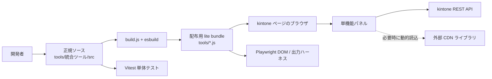

# 技術構成・ライブラリ一覧・設計資料

この文書は、`kintone-lite-suite` の保守担当者が、利用技術、外部依存、ソースと配布物の関係、主要な実行フローを一か所で把握するための資料です。バージョンの正本は各 `package.json` / `package-lock.json` と `tools/統合ツール/src/constants.ts` です。

## 1. システム概要

本リポジトリは、kintone の設定比較、プレビュー環境への設定反映、設計書・ER図の出力、レコード運用を支援する **11 本の単機能 lite ツール**を管理します。利用者はビルド済み JavaScript を kintone ページ上で実行し、各ツールのパネルから kintone REST API を呼び出します。

| 項目 | 内容 |
| --- | --- |
| 実行環境 | kintone の同一オリジン上で動作するブラウザ JavaScript |
| 開発言語 | TypeScript（設定は `tools/統合ツール/tsconfig*.json`） |
| 配布形式 | esbuild で生成した ES2020 向け IIFE、機能ごとの単一 `.js` ファイル |
| 正規ソース | `tools/統合ツール/src/` |
| 配布物 | `tools/` 直下の 11 本の `.js` |
| 外部接続 | kintone REST API、および機能実行時に必要となる CDN |
| 対応開発環境 | Node.js 20 以上、npm 10 以上 |

統合版 `tools/統合ツール.js` は廃止済みです。各 lite エントリは、実行場所が kintone ページであることを確認してから、必要な UI と機能だけを起動します。

## 2. 全体アーキテクチャ



### レイヤーと責務

| レイヤー | 主な場所 | 責務 |
| --- | --- | --- |
| 起動・エントリ | `src/entries/*-lite-entry.ts` | kintone ページ判定、対応する lite UI の起動 |
| lite UI | `src/entries/*-lite-ui.ts` | 入力、確認、進捗、結果表示。共通パネル部品を利用 |
| 機能ロジック | `src/tabs/` | 設定比較、設計書、ER図、レコード処理などのユースケース |
| 差分エンジン | `src/diff/` | 正規化、比較、レビュー、HTML / XLSX 出力 |
| 反映エンジン | `src/reflect/` | 反映計画、事前検査、適用、結果と履歴の集約 |
| API・共通処理 | `src/api.ts`, `src/utils.ts`, `src/kintone-query.ts` | REST API、ページング、書込ガード、共通変換・ダウンロード |
| 共通 UI | `src/entries/litePanelTheme.ts`, `src/ui/` | パネル、部品、スタイル、ダイアログ |
| 型定義 | `src/types/`, `src/kintone-enums.ts` | kintone、外部グローバル、UI 参照の型 |
| ビルド | `build.js`, `src/featureDefs.mjs` | エントリ定義、CSS インライン化、IIFE 生成、棚卸し生成 |
| テスト | `tests/`, `tools/test-harness/` | 純粋ロジックの単体テスト、ブラウザ操作と成果物の回帰検証 |

## 3. 配布ツール一覧

| 機能 | 配布ファイル | lite エントリ | 主な正規実装 |
| --- | --- | --- | --- |
| 差分比較 | `tools/差分比較.js` | `entries/diff-lite-entry.ts` | `tabs/diff*.ts`, `diff/` |
| プレビュー反映 | `tools/プレビュー反映.js` | `entries/reflect-lite-entry.ts` | `tabs/reflect*.ts`, `reflect/` |
| フィールド追加 | `tools/フィールド追加.js` | `entries/field-lite-entry.ts` | `tabs/field*.ts` |
| JS/CSS 設定 | `tools/kintoneJS取得.js` | `entries/jsconfig-lite-entry.ts` | `tabs/jsconfig*.ts` |
| 設定一括取得 | `tools/設定取得.js` | `entries/settings-export-lite-entry.ts` | `tabs/settings-export*.ts` |
| 設計書 | `tools/設計書作成.js` | `entries/design-lite-entry.ts` | `tabs/design*.ts` |
| ER図 | `tools/ER図.js` | `entries/er-lite-entry.ts` | `tabs/er*.ts`, `tabs/er-model.ts`, `tabs/er-analysis.ts` |
| プロセス図 | `tools/プロセス実行.js` | `entries/process-lite-entry.ts` | `tabs/process*.ts` |
| レコード管理 | `tools/kintoneレコード取得.js` | `entries/record-lite-entry.ts` | `tabs/record*.ts` |
| CSV出力 | `tools/CSV出力.js` | `entries/csv-export-lite-entry.ts` | `tabs/record-csv-export.ts`, `tabs/record-standalone.ts` |
| データ品質チェック | `tools/データ品質チェック.js` | `entries/record-quality-lite-entry.ts` | `tabs/record-quality*.ts`, `tabs/record-template.ts` |

`tools/*.js` と `tools/単機能スクリプト棚卸し.md` は生成物です。修正は正規ソースへ行い、ビルドで再生成します。

## 4. ライブラリ一覧

### 4.1 npm の直接依存

本番 bundle に npm パッケージを直接 import する構成ではありません。次のパッケージは、ビルド、型検査、テスト、または ER 図ハーネスで使用する **開発時依存**です。

| パッケージ | 宣言バージョン | 配置 | 用途 |
| --- | --- | --- | --- |
| `@playwright/mcp` | `0.0.70` | ルート | Playwright MCP とブラウザ自動操作基盤。ハーネスでは同依存が導入する Playwright を利用 |
| `@types/node` | `^22.9.0` | 統合ツール | Node.js API の TypeScript 型定義 |
| `esbuild` | `^0.25.0` | 統合ツール | TypeScript と CSS を機能別 IIFE に bundle |
| `typescript` | `^5.6.3` | 統合ツール | 通常および strict の静的型検査 |
| `vitest` | `^4.1.7` | 統合ツール | 単体テストランナー |
| `cytoscape` | `3.28.1` | 統合ツール | ER 図のブラウザ回帰テストで CDN をローカル実体に差し替えるために使用 |
| `dagre` | `0.8.5` | 統合ツール | ER 図の階層レイアウトをローカル検証 |
| `cytoscape-dagre` | `2.5.0` | 統合ツール | Cytoscape と Dagre の連携をローカル検証 |

間接依存を含む厳密な解決バージョンと整合性ハッシュは `package-lock.json` および `tools/統合ツール/package-lock.json` を正本とし、この文書へ重複転記しません。

### 4.2 実行時に CDN から読み込む依存

これらは bundle へ同梱されず、該当機能を使うときにブラウザから読み込みます。そのため、kintone 環境の Content Security Policy、プロキシ、ネットワーク制限の影響を受けます。

| ライブラリ | バージョン | 主な用途 | 読込元・備考 |
| --- | --- | --- | --- |
| JSZip | 3.10.1 | 設定、JS/CSS、添付、CSVひな形などの ZIP 作成 | cdnjs。lite 共通ローダーは失敗と30秒タイムアウトを表示 |
| Cytoscape.js | 3.28.1 | 出力した ER 図 HTML のグラフ描画 | cdnjs。代替は jsDelivr の 3.26.0 |
| Dagre | 0.8.5 | ER 図の階層レイアウト | jsDelivr |
| cytoscape-dagre | 2.5.0 | Cytoscape.js で Dagre を利用 | jsDelivr の minified / non-minified 候補 |
| Google Fonts | バージョン指定なし | ER 図 HTML の DM Sans / DM Mono | Google Fonts。取得不可でもシステムフォントで表示可能 |
| JSONEditor | 9.10.3 | 旧統合 UI の JSON 編集補助 | cdnjs。現行 lite の中心経路では textarea ベースの UI も使用 |
| Toastify JS | 1.12.0 | 旧統合 UI の通知 | jsDelivr |
| Driver.js | 1.3.1 | 旧統合 UI のガイドツアー | jsDelivr |
| Mermaid | 10.6.1 | 旧統合 UI のプロセス図描画 | jsDelivr → unpkg → cdnjs の順で試行。失敗時は簡易 HTML 表示 |
| xlsx-js-style | 1.2.0 | 設計書 XLSX のスタイル付き生成 | jsDelivr。失敗時は SheetJS 0.18.5 を試行 |
| SheetJS (`xlsx`) | 0.18.5 | 設計書 XLSX のフォールバック生成 | jsDelivr。差分比較 XLSX は外部ライブラリを使わず自前生成 |

URL の正本は原則 `src/constants.ts` です。ただし Mermaid の候補 URL は `src/tabs/process.ts`、設計書 XLSX の候補 URL は `src/tabs/design-xlsx.ts` にあります。

### 4.3 プラットフォーム API とブラウザ標準機能

- kintone JavaScript API / REST API: アプリ設定、フォーム、レコード、ファイル、プロセス管理などを取得・更新します。
- Fetch、DOM、Blob、FileReader、URL、Clipboard API: 通信、パネル表示、成果物保存、コピーに使用します。
- Node.js 標準モジュール: ビルドとハーネスで `fs`、`path`、`url`、`crypto`、`assert`、`child_process`、`vm` などを使用します。

## 5. 主要なデータフロー

### 5.1 読み取り・出力系

1. 利用者が接続先、App ID、対象範囲を入力する。
2. lite UI が入力を検証し、`api.ts` のラッパーを介して kintone REST API を呼ぶ。
3. 機能ロジックが取得結果を正規化・集約する。
4. HTML、Markdown、JSON、CSV、XLSX、ZIP または Mermaid ソースをブラウザ内で生成する。
5. Blob URL などを使って利用者端末へ保存する。取得失敗や部分成功は結果に明示する。

### 5.2 設定反映・レコード更新系

1. 対象、方向、入力 JSON、削除を伴う変更を事前検査する。
2. 実行計画と確認画面を提示する。
3. 必要なバックアップを作成してから、プレビュー用 API またはレコード API を呼ぶ。
4. 設定更新では取得した `revision` を送り、外部更新との競合を検出する。
5. レコード一括更新は 100 件以下へ分割する。
6. 成功、失敗、未実行、再試行対象を利用者へ返す。

### 5.3 大量レコード取得

- API の1回の取得上限は 500 件です。
- `order by` がないクエリは `$id` シーク、並び順があるクエリは cursor API を使い、10,000 件超の offset 依存を避けます。
- 処理上限、取得失敗、部分取得を成功扱いで隠しません。

## 6. 設計上の重要な判断

### 軽量な単機能 bundle

1つの巨大な統合 UI ではなく、目的ごとのエントリから必要なコードだけを bundle します。配布と起動が単純になり、利用者が誤って別機能を実行する範囲を抑えます。

### 生成物と正規ソースの分離

配布用 JavaScript と棚卸し Markdown は `build.js` が生成します。生成物を直接修正せず、TypeScript またはエントリ定義を修正することで、再ビルド可能性を維持します。

### ブラウザ内処理

取得データと成果物は原則としてブラウザ内で処理します。別のアプリケーションサーバーは持ちません。ただし、動的ライブラリの取得先 CDN と kintone REST API への通信は発生します。

### 安全な書き込み

設定の書き込みは原則プレビュー環境に限定し、レコード API など明示した例外以外の本番 prefix への更新をガードします。revision 競合、削除件数、比較方向、部分失敗を明示し、無言の上書きを避けます。

### 外部依存の縮退動作

CDN 依存が取得できない可能性を前提に、代替 CDN、簡易表示、明示的なエラーのいずれかを用意します。差分比較 XLSX は外部 CDN に依存しない実装です。

## 7. ビルドと検証

```bash
npm ci
npm run setup
npm run check
git diff --exit-code
```

`npm run check` は、ブラウザストレージ禁止検査、通常型検査、strict 型検査、Vitest、全 lite bundle のビルドを順に実行します。UI または成果物レイアウトを変更した場合は、`tools/test-harness/README.md` から対応する Playwright ハーネスも実行します。

| 変更対象 | 最低限の追加確認 |
| --- | --- |
| 共通 UI / 検索 | `npm run test:lite-shared` |
| 設計書、設定取得、ER図、プロセス図、CSV等の操作 | `npm run test:lite-workflows` |
| 出力レイアウト | `npm run test:output-layouts` |
| 差分比較 | 対象に応じた `test:diff-*` |
| プレビュー反映 | `npm run test:reflect-dom` |
| ER 図 | `npm run test:er-compare` |
| 全機能 | `npm run test:all` |

## 8. 依存更新時のチェックリスト

1. `package.json` または外部ライブラリ URL のバージョンを更新する。
2. npm 依存なら対応する lockfile を `npm install` で更新する。
3. CDN 依存なら、グローバル変数名、CSS、代替 URL、CSP の許可先が一致するか確認する。
4. `npm run check` を実行し、生成物の差分もレビューする。
5. 関連する Playwright ハーネスで通常経路と CDN 遮断時の挙動を確認する。
6. この一覧と、必要に応じて `tools/統合ツール/README.md` を更新する。

## 9. 関連資料

- `README.md`: リポジトリの入口、セットアップ、利用上の注意
- `tools/統合ツール/README.md`: 統合ツールの開発・ビルド詳細
- `tools/統合ツール/AGENTS.md`: 生成物、正規ソース、共有モジュールの保守ルール
- `tools/統合ツール_機能説明.md`: 利用者向けの機能説明
- `tools/test-harness/README.md`: ブラウザ・成果物ハーネス
- `docs/diff-comparison-logic.md`: 差分比較の詳細設計
- `docs/preview-reflection.md`: プレビュー反映の安全設計
- `docs/api-response-improvements.md`: API レスポンスを利用する補助機能
- `docs/record-quality-and-template.md`: データ品質検査と CSV ひな形

